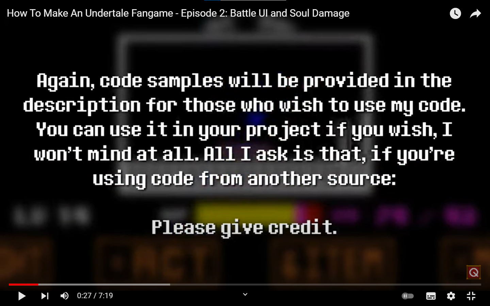

QSVFangameSkeleton
========================

So, I put [QSV Gaming](https://www.youtube.com/c/QSVGaming)'s stuff in his How To Make An Undertale Fangame series together into a [GameMaker Studio 2](https://www.yoyogames.com/get) project.

The series is cool, you should check it out! Also check the [official code snippet repo](https://github.com/TheRealQSV/UT-CodeSnippets)

## GameMaker Studio 2 IDE Version

This project currently uses IDE version `v2022.2.1.618`, and is tested with Runtime `v2022.2.1.491`.

## Current Progress

  * [Episode 1](https://www.youtube.com/watch?v=QYtUkzjWd-Q)
  * [Episode 2](https://www.youtube.com/watch?v=SZP7AL6PKGg)
  * [Episode 3](https://www.youtube.com/watch?v=mZrT2cplb5g)

## License

This is yet to be licensed with an actual license. [QSV's code snippet repo](https://github.com/TheRealQSV/UT-CodeSnippets) may have one soon, and if it does, I'll use the license it uses.

Meanwhile, have this:
